# STM32_learning

- 资源
  - [野火产品资料下载中心 — 野火产品资料下载中心 文档 (embedfire.com)](https://doc.embedfire.com/products/link/zh/latest/index.html)
  - [150集-野火F103霸道/指南者视频教程](https://www.bilibili.com/video/BV1Xs411g7Aj/?spm_id_from=333.999.0.0&vd_source=e4455003e32fdc49fb1b368513cd60bd)


- 文件夹结构

  - 00_STM32官方资料
  - 01\_野火指南者\_源码教程
  - 02\_野火指南者\_开发板资料

  


## 01_标准库教程笔记

-   教材资料：[野火]STM32 库开发实战指南 ——基于野火指南者开发板


-   开机测试例程

    - 整版硬件测试
        - 开机测试
            - **需要刷写出厂测试程序**
                - ./Project/RVMDK(uv5)/iSO-STM32.uvprojx
                - build
                - download
        - APP 使用说明
            - 介绍出厂测试程序的使用方法

    - 开发板硬件资源简介


### 第1章 前言与学习必读

- 参考资料
  - 《STM32F10x-中文参考手册》
  - 《Cortex-M3 权威指南》
- 每章的主要内容
  - 外设简介
  - 外设功能框图分析
  - 代码讲解
- 配套硬件
  - 野火 STM32-F103VE-指南者


### 第2章 如何安装 KEIL5 和打开例程

#### 安装 Keil 5 与 STM32 芯片包 

- 安装 Keil 5 
  - 官网下载：
    - [Keil Product Downloads](https://www.keil.com/download/product/)
    - 下载 MDK-ARM
  - 百度网盘
    - [KEIL和芯片包_免费高速下载|百度网盘-分享无限制 (baidu.com)](https://pan.baidu.com/s/1QlyvCgg-ZYLomvp8tOtDtw#list/path=%2F)
  - 注意
    - 不要使用中文安装路径
    - KEIL5 的安装目录不能跟其他版本的 KEIL 冲突
    - 教育用户有编译大小限制，需要注册为Pro用户
- 安装 STM32 芯片包 
  - 官网下载：http://www.keil.com/dd2/pack/
  - 把下载好的包双击安装即可，安装路径选择跟 KEIL5 一样的安装路径，安装成功之后，在 KEIL5的 Pack Installer 中就可以看到我们安装的包
  - 新建工程的时候，就有对应的单片机的型号可选


#### KEIL5 简介

- ##### 如何打开工程文件

  - 直接找到.uvprojx 后缀名文件

  - 以工程模板形式打开项目
    - .uvprojx 文件主要存放在 Project 文件夹下

- 主界面
  - 菜单栏：包含 File 文件、Edit 编辑、View 视图、Project 工程、Help 帮助等
  - 工具栏：常见工具的快捷按钮，
    - 仿真类快捷按钮：在进行仿真时使用，具有断电标记作用
    - 编译类快捷按钮：对代码进行编译下载
    - 工程目标选项又称魔术棒：即对工程目标的配置，如芯片设备选择、C/C++ 选项、仿真配置等等
  - 工程窗口：主要显示项目内容，文件组、源文件和头文件等
  - 编辑窗口：编写代码的地方
  - 消息窗口：反馈编译信息、烧录信息等
  - 状态栏：光标的行列位置、字符编码、键盘 NUM 锁定等一些状态信息


### 第3章 如何用 DAP 仿真器下载程序

#### 仿真器  Fire-Debugger

- 遵循 ARM 公司的 CMSIS-DAP 标准
- 支持所有基于 Cortex-M内核的单片机如 M3，M4，M7
- 支持下载和在线仿真程序
- 支持Windows，免驱
- 支持 KEIL、IAR
- 支持
  - JTAG (20Pin)
  - SWD (5Pin)
  - V-UART (4Pin)

#### 仿真器硬件连接

- win<--->USB<--->Fire DAP仿真器<--->JTAG排线<--->开发板（开发板本身需要上电）

#### 仿真器配置

- Debug
  - Use: CMSIS-DAP Debugger
  - Settings: 
    - Debug:
      - JTAG/SW Adapter
        - 自动识别为 fireDAP CMSIS-DAP
      - SW接口
        - 选择SW接口
        - 勾选SWJ
        - Max Clock 5MHz
      - SW Device
        - SWDIO: 连接了开发板并上电后，仿真器会识别开发板芯片
      - Reset:
        - 老版Keil 5: Autodetect
        - Keil 5 (v5.36): SYSRESETREQ(Default)
      - 注意
        - 如果是普通 DAP 记得打开我们提供的写好的每一个工程后，在仿真器配置界面左下角改选为 Connect：under Reset 才能下载。
        - 普通 DAP 要试 Debug 时，Reset 选择 HW RESET 或者 VECTRESTET 这样在 Debug 时可
    - Flash Download 选择目标板
      - 选择 Erase Section
        - 选择 fullchip 非常慢
      - 勾选 Verify, Reset and Run 自动运行，无需复位
      - Programming Algorithm
        - 显示对应的芯片算法
- Utilities
  - Use Debug Driver

#### 仿真器编译下载

- build
  - 教育证书有编译大小限制，注册为Pro用户
- load


### 第4章 如何用串口下载程序

#### 串口下载

-   Windows：USB转串口驱动，安装成功后在设备管理器端口下能看到对应设备
-   硬件：电脑<-->USB转串口接口<-->开发板
-   串口下载软件
    -   mcuisp
        -   ISP 已不再适合STM32F4、F7等，建议用FlyMcu
    -   FlyMcu
        -   搜索串口
        -   波特率
        -   HEX 文件
        -   校验、编程后执行
        -   DTR 低电平复位，RTS 高电平进入 bootloader（上位机软件为 232 逻辑电平标准）
        -   选项字节 下载程序后不能自动运行
        -   开始编程
        -   若一直连接，按开发板复位键

#### ISP 简介

-   **ISP（In-System Programming）在系统可编程**
    -   电路板上的空白器件可以编程写入最终用户代码， 而不需要从电路板上取下器件
    -   已经编程的器件也可以用 ISP 方式擦除或再编程
    -   需要用到 (bootloader) 自举程序
        -   自举程序存储在 STM32 器件的内部自举 ROM 存储 器（系统存储器）中
        -   通过一种可用的串行外设（USART、CAN、USB、I2C 等）将 应用程序下载到内部 Flash 中
-   ISP 步骤
    -   电脑通过 USB 转串口线连接 STM32 的 USART1，并打开电脑端的上位机；
    -   保持 BOOT0 为高电平，BOOT1 为低电平； 
    -   复位单片机使其进入 bootloader 模式，通过上位机下载程序； 
    -   下载完毕，保持 BOOT0 为低电平，BOOT1 为低电平； 
        -   下载程序需要跳线及复位操作，很繁琐。
        -   用上位机去控制 BOOT0 脚和单片机的复位脚，可实现一键下载
    -    复位单片机即可启动用户代码，正常运行。
-   ISP 一键下载电路分析
    -   见教材


### 第5章 初识 STM32

#### STM32

-   ST 是意法半导体，M 是 Microelectronics 的缩写，32 表示 32 位
-   自带了各种常用通信接口，比如 USART、I2C、SPI 等
-   内核上分有 Cortex-M0、M3、M4 和 M7 这几 种，每个内核又大概分为主流、高性能和低功耗
    -   F1 代表了基础型，基于 Cortex-M3 内核核，主频为 72MHZ
    -   F4 代表了高性能，基于 Cortex-M4 内核，主频 180M
-   命名规则见教材

#### MCU 选型

-   确认性能
    -   普通应用，不需要接大屏幕的一般选择 Cortex-M3 内核的 F1 系列
    -   求高性能，需要大 量的数据运算，且需要外接 RGB 大屏幕的则选择 Cortex-M4 内核的 F429 系列
-   选择 FLASH 大小
-   确定引脚
    -   最小系统
        -   电源
            -   VBAT
            -   VDD VSS
            -   VDDA VSSA
            -   VREF+
            -   VREF-
        -   晶振IO
            -   主晶振IO
            -   RTC晶振IO
        -   下载IO
            -   JTAG IO
                -   用于 JTAG 下载
                -   JTMS、JTCK、JTDI、JTDO、NJTRST
        -   BOOT IO
            -   用于设置系统启动方式
            -   BOOT0，BOOT1
        -   复位IO
            -   用于外部复位
            -   NRST
    -   GPIO
        -   专用总线
            -   I2C
            -   SPI
            -   SDIO
            -   FSMC
            -   DCMI
        -   普通元器件 GPIO
            -   蜂鸣器
            -   LED
            -   ...
        -   ...

#### 如何寻找IO说明

-   数据手册主要用于芯片选型和设计原理图时参考
    -   引脚定义 Pinouts and pin description
        -   详见PDF P53
    -   找出MCU中所有的引脚定义，用于后续绘制原理图
-   参考手册主要用于在编程的时候 查阅

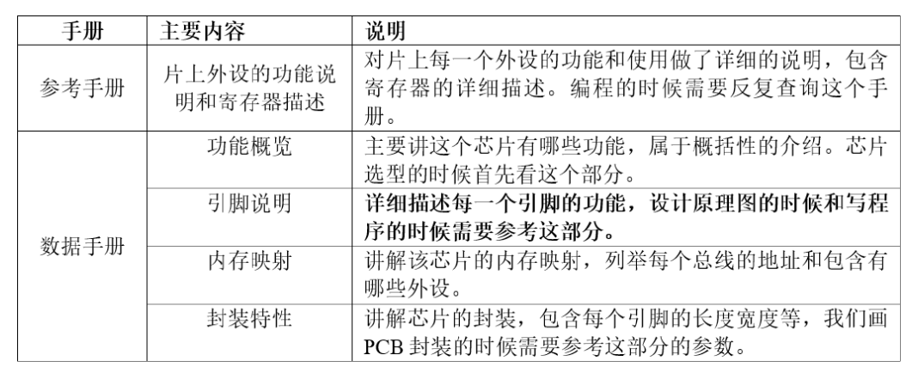

#### PCB 打样贴片

-   [深圳嘉立创](https://www.jlc.com/)


### 第6章 深入了解STM32 (什么是寄存器)

-   参考
    -   《STM32F10xx 参考手册》
        -   存储器和总线架构
        -   通用 I/O(GPIO)
    -   《STM32F10xx 数据手册》


#### 引脚 Pin

-   左下角的小圆点表示 1 脚，然后从 1 脚起按照逆时针的顺序排列
-   通过程序控制这些引脚输出高电平或者低电平，控制各种传感器工作

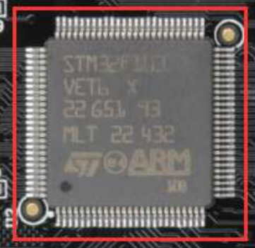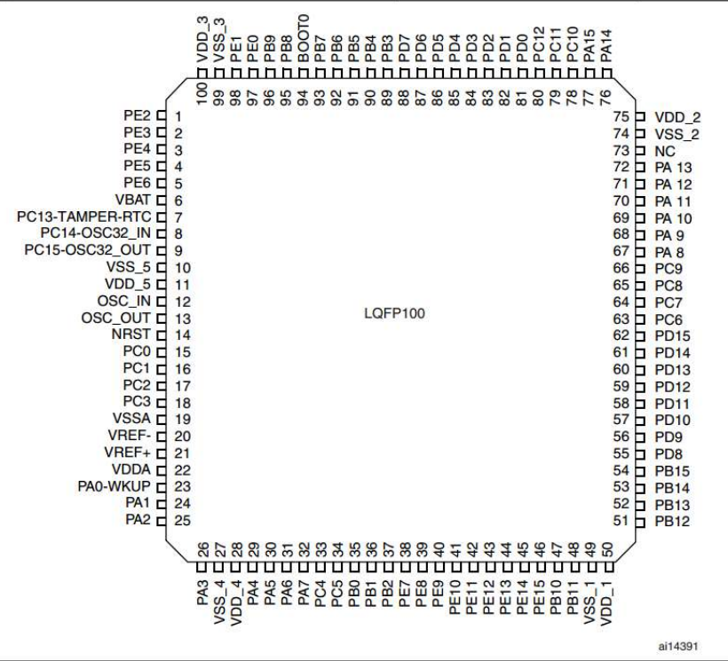


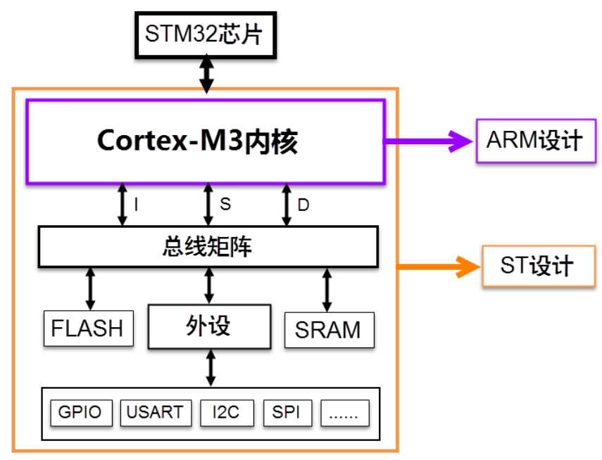

#### 内核

-   Cortex-M3 (ARM)
-   驱动单元，总线
    -   ICode 指令（Intruction ）总线
        -   内核通过ICode总线读取FLASH中的指令，用于执行程序
    -   DCode 数据（Data ）总线
        -   常量（Const）存放于Flash中，
        -   变量存放于内部SRAM中
        -   数据同样可以被DMA总线访问，为避免冲突需要总线矩阵进行仲裁
    -   System 系统总线
        -   访问外设寄存器，进行寄存器编程
    -   DMA 总线
        -   主要是用来传输数据
        -   可以访问外设的数据寄存器、SRAM、FLASH等
        -   数据同样可以被DMA总线访问，为避免冲突需要总线矩阵进行仲裁

#### 片上外设

-   GPIO、USART（串口）、I2C、SPI
-   被动单元
    -   内部FLASH
        -   闪存储存器，存放指令程序
        -   内核通过ICode访问
    -   内部SRAM
        -   存放程序变量、堆栈
        -   内核通过DCode访问
    -   FSMC
        -   Flexible static memory controller 灵活静态储存器控制器
        -   拓展内存如外部的 SRAM，NAND-FLASH 和 NORFLASH
    -   AHB总线 
        -   挂载STM32 各种各样的特色外设
        -   APB1总线
        -   APB2总线

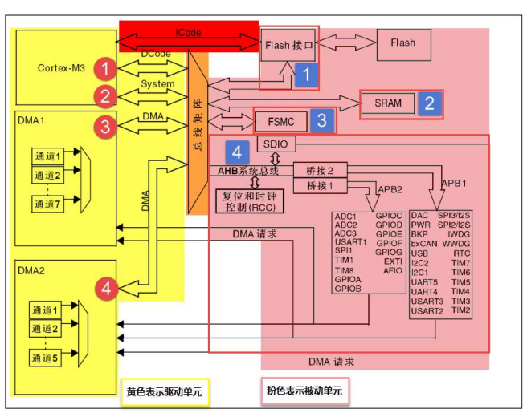


#### 储存器映射

-   被控单元的 FLASH，RAM，FSMC 和 AHB 到 APB 的桥

    -   这些功能部件共同排列在一个 4GB 的地址空间内。我们在编程的时候，可以通过他们的地址找到他们

-   存储器本身不具有地址信息，它的地址是由芯片厂商或用户分配，给存储器分配地址的过程就称 为存储器映射，给存储器再分配一个地址就叫存储器重映射

-   储存器映射分布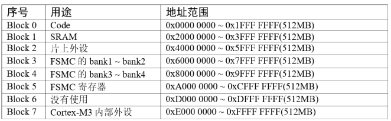

    -   Block0-Flash

        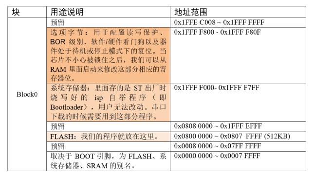

    -   Block1-SRAM

        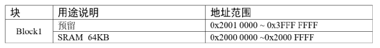

    -   Block2-片上外设

        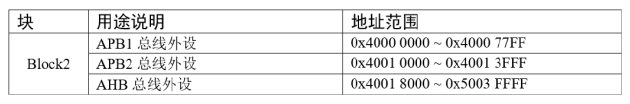

#### 寄存器映射

##### 寄存器介绍

-   直接控制Block2中片上外设的内存地址，不方便记忆，容易出错

-   根据每个单元功能不同，取一个别名，即寄存器

-   给已经**分配好地址的有特定功能的内存单元**取**别名**的过程就叫**寄存器映射**

-   例：

    -   GPIOB 端口的输出数据寄存器 ODR 的地址是 0x40010C0C

    -   ODR 寄存器是 32bit，低 16bit 有效，对应着 16 个 外部 IO，写 0/1 对应的的 IO 则输出低/高电平

    -   通过 C 语言指针的操作方式，让 GPIOB 的 16 个 IO 都输出高电平

        ```c
        // 通过绝对地址访问内存单元
        // GPIOB 端口全部输出 高电平
        // 需要将0x40010C0C转换为指针类型，再对指针进行*操作
        *(unsigned int*)(0x40010C0C) = 0xFFFF;
        
        // 通过寄存器别名方式访问内存单元
        // GPIOB 端口全部输出 高电平
        #define GPIOB_ODR *(unsigned int*)(GPIOB_BASE+0x0C)
        GPIOB_ODR = 0xFF;
        ```
        

##### STM32外设地址映射

-   片上外设区分为三条总线

    -   APB1 挂载低速 外设，
    -   APB2 和 AHB 挂载高速外设

    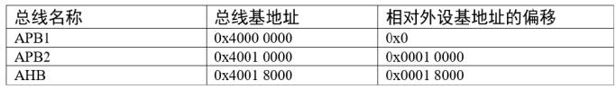

-   外设基地址：

    -   总线上挂载着各种外设，这些外设也有自己的地址范围

    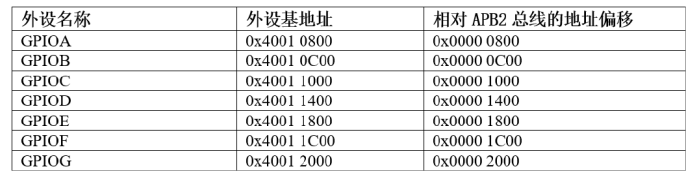

-   外设寄存器

    -   外设的寄存器说明可参考《STM32F10xx 参考手册》

    -   例：GPIOB 的寄存器

        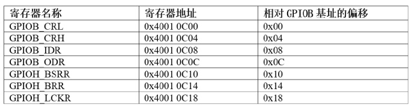

    -   例：GPIO 端口置位/复位寄存器

        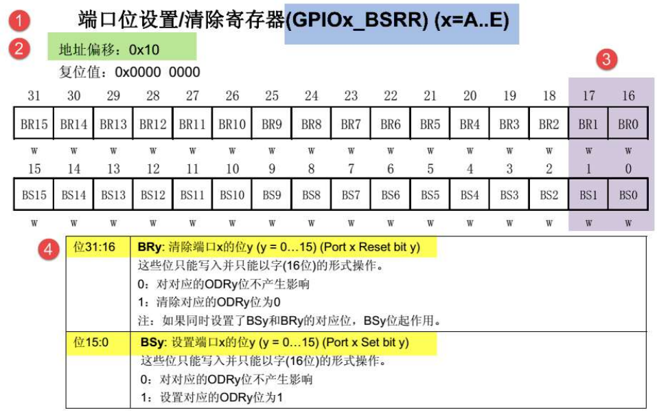

        1.  寄存器名称
        2.  偏移地址
        3.  寄存器位表
        4.  位功能说明

##### C语言对寄存器的封装

-   封装总线和外设基地址

    ```c
    /* 外设基地址 */
    #define PERIPH_BASE ((unsigned int)0x40000000)
    
    /* 总线基地址 */
    #define APB1PERIPH_BASE PERIPH_BASE
    #define APB2PERIPH_BASE (PERIPH_BASE + 0x00010000)
    #define AHBPERIPH_BASE (PERIPH_BASE + 0x00020000)
    
    /* GPIO 外设基地址 */
    #define GPIOA_BASE (APB2PERIPH_BASE + 0x0800)
    #define GPIOB_BASE (APB2PERIPH_BASE + 0x0C00)
    #define GPIOC_BASE (APB2PERIPH_BASE + 0x1000)
    #define GPIOD_BASE (APB2PERIPH_BASE + 0x1400)
    #define GPIOE_BASE (APB2PERIPH_BASE + 0x1800)
    #define GPIOF_BASE (APB2PERIPH_BASE + 0x1C00)
    #define GPIOG_BASE (APB2PERIPH_BASE + 0x2000)
    
    /* 寄存器基地址，以 GPIOB 为例 */
    #define GPIOB_CRL (GPIOB_BASE+0x00)
    #define GPIOB_CRH (GPIOB_BASE+0x04)
    #define GPIOB_IDR (GPIOB_BASE+0x08)
    #define GPIOB_ODR (GPIOB_BASE+0x0C)
    #define GPIOB_BSRR (GPIOB_BASE+0x10)
    #define GPIOB_BRR (GPIOB_BASE+0x14)
    #define GPIOB_LCKR (GPIOB_BASE+0x18)
    ```

-   控制寄存器

    ```c
    /* 控制 GPIOB 引脚 0 输出低电平 (BSRR 寄存器的 BR0 置 1) */
    *(unsigned int *)GPIOB_BSRR = (0x01<<(16+0));
    
    /* 控制 GPIOB 引脚 0 输出高电平 (BSRR 寄存器的 BS0 置 1) */
    *(unsigned int *)GPIOB_BSRR = 0x01<<0;
    
    unsigned int temp;
    /* 读取 GPIOB 端口所有引脚的电平 (读 IDR 寄存器) */
    temp = *(unsigned int *)GPIOB_IDR;
    ```

-   封装寄存器列表（结构体）

    ```c
    typedef unsigned int uint32_t; // 无符号 32 位变量 
    typedef unsigned short int uint16_t; // 无符号 16 位变量
    
    // GPIO 寄存器列表
    // 结构体内变量的存储空间是连续的
    // 其中 32 位的变量占用 4 个字节，16 位的变量占用 2 个字节
    typedef struct {
    	uint32_t CRL; // GPIO 端口配置低寄存器 地址偏移: 0x00
        uint32_t CRH; // GPIO 端口配置高寄存器 地址偏移: 0x04 
    	uint32_t IDR; // GPIO 数据输入寄存器 地址偏移: 0x08 
    	uint32_t ODR; // GPIO 数据输出寄存器 地址偏移: 0x0C 
    	uint32_t BSRR; // GPIO 位设置/清除寄存器 地址偏移: 0x10 
    	uint32_t BRR; // GPIO 端口位清除寄存器 地址偏移: 0x14 
    	uint16_t LCKR; // GPIO 端口配置锁定寄存器 地址偏移: 0x18 
    } GPIO_TypeDef;
    
    // 定义一个 GPIO_TypeDef 型结构体指针 GPIOx
    GPIO_TypeDef * GPIOx; 
    // 把指针地址设置为宏 GPIOB_BASE 地址
    GPIOx = GPIOB_BASE; 
    
    // 设置寄存器
    GPIOx->IDR = 0xFFFF;
    GPIOx->ODR = 0xFFFF;
    
    // 读取 GPIOB_IDR 寄存器的值到变量 temp 中
    uint32_t temp;
    temp = GPIOx->IDR; 
    ```

-   直接使用宏定义好 GPIO_TypeDef 类型的指针

    ```c
    // 使用 GPIO_TypeDef 把地址强制转换成指针
    #define GPIOA ((GPIO_TypeDef *) GPIOA_BASE)
    #define GPIOB ((GPIO_TypeDef *) GPIOB_BASE)
    #define GPIOC ((GPIO_TypeDef *) GPIOC_BASE)
    #define GPIOD ((GPIO_TypeDef *) GPIOD_BASE)
    #define GPIOE ((GPIO_TypeDef *) GPIOE_BASE)
    #define GPIOF ((GPIO_TypeDef *) GPIOF_BASE)
    #define GPIOG ((GPIO_TypeDef *) GPIOG_BASE)
    #define GPIOH ((GPIO_TypeDef *) GPIOH_BASE)
    
    // 使用定义好的宏直接访问
    // 访问 GPIOB 端口的寄存器
    GPIOB->BSRR = 0xFFFF; // 通过指针访问并修改 GPIOB_BSRR 寄存器
    GPIOB->CRL = 0xFFFF; // 修改 GPIOB_CRL 寄存器
    GPIOB->ODR = 0xFFFF; // 修改 GPIOB_ODR 寄存器
    uint32_t temp_1;
    temp_1 = GPIOB->IDR; // 读取 GPIOB_IDR 寄存器的值到变量 temp 中
    
    // 访问 GPIOA 端口的寄存器
    GPIOA->BSRR = 0xFFFF;
    GPIOA->CRL = 0xFFFF;
    GPIOA->ODR =0xFFFF;
    
    uint32_t temp_2;
    temp_2 = GPIOA->IDR; //读取 GPIOA_IDR 寄存器的值到变量 temp 中
    ```

##### 修改寄存器的位操作方法

-   变量的某位清零

    ```c
    // 定义一个变量 a = 1001 1111 b (b 表示二进制数)
    unsigned char a = 0x9f;
    
    // 对 bit2 清零
    // 括号中的 1 左移两位，(1<<2) 得二进制数：0000 0100 b
    // 按位取反，~(1<<2) 得 1111 1011 b
    // 假如 a 中原来的值为二进制数： a = 1001 1111 b
    // 所得的数与 a 作”位与&”运算，a = (1001 1111 b)&(1111 1011 b),
    // 经过运算后，a 的值 a=1001 1011 b
    // a 的 bit2 位被清零，而其它位不变。
    a &= ~(1<<2);
    ```

-   变量的某几个连续位清零

    ```c
    // 若把 a 中的二进制位分成 2 个一组
    // 即 bit0、bit1 为第 0 组，bit2、bit3 为第 1 组，
    // bit4、bit5 为第 2 组，bit6、bit7 为第 3 组
    // 要对第 1 组的 bit2、bit3 清零
    
    // 括号中的 3 左移两位，(3<<2*1) 得二进制数：0000 1100 b
    // 按位取反，~(3<<2*1) 得 1111 0011 b
    // 假如 a 中原来的值为二进制数： a = 1001 1111 b
    // 所得的数与 a 作”位与&”运算，a = (1001 1111 b)&(1111 0011 b),
    // 经过运算后，a 的值 a=1001 0011 b
    // a 的第 1 组的 bit2、bit3 被清零，而其它位不变。
    a &= ~(3<<2*1);
    
    // 上述 (~(3<<2*1)) 中的 (1) 即为组编号; 如清零第 3 组 bit6、bit7 此处应为 3
    // 括号中的 (2) 为每组的位数，每组有 2 个二进制位; 若分成 4 个一组，此处即为 4
    // 括号中的 (3) 是组内所有位都为 1 时的值; 若分成 4 个一组，此处即为二进制数“1111 b”
    // 例如对第 2 组 bit4、bit5 清零
    a &= ~(3<<2*2);
    
    ```

-   变量的某几位进行赋值

    ```c
    // a = 1000 0011 b
    // 此时对清零后的第 2 组 bit4、bit5 设置成二进制数“01 b ”
    // a = 1001 0011 b，成功设置了第 2 组的值，其它组不变
    a |= (1<<2*2);
    
    ```

-   变量的某位取反

    ```c
    // a = 1001 0011 b
    // 把 bit6 取反，其它位不变
    // a = 1101 0011 b
    a ^=(1<<6);
    
    ```

    

### 第 7 章 新建工程—寄存器版

